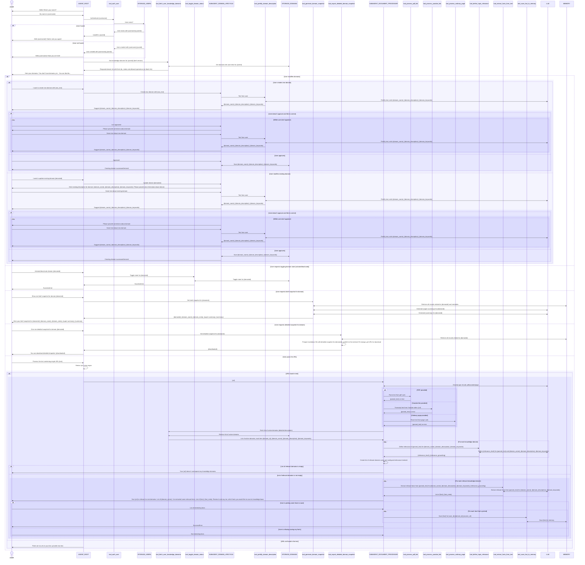

```mermaid
sequenceDiagram

	actor u as USER
	participant a_root as AGENT_ROOT
	participant t_auth as tool_auth_user
	participant s_users as STORAGE_USERS
	participant t_domains as tool_fetch_user_knowledge_domains
	participant t_toggler as tool_toggle_domain_status
	participant a_domains as SUBAGENT_DOMAIN_LIFECYCLE
	participant t_prettifier as tool_prettify_domain_description	
	participant s_domains as STORAGE_DOMAINS
	participant t_brief as tool_generate_domain_snapshot
	participant t_details as tool_export_detailed_domain_snapshot
	participant a_doc as SUBAGENT_DOCUMENT_PROCESSOR
	participant t_pdf as tool_process_pdf_link
	participant t_yt as tool_process_youtube_link
	participant t_page as tool_process_ordinary_page
	participant t_relev as tool_define_topic_relevance
	participant t_facts as tool_extract_facts_from_text
	participant t_mem as tool_save_fact_to_memory
	
	participant llm as LLM
	participant mem as MEMORY
	
	%% All prompts and instructions should me clarified
	
	%% All the AGENT_ROOT behaviour is coordinated by LLM and prompts
	a_root ->> u: Hello! What's your name?
	u ->> a_root: My name is {username}
	a_root ->> t_auth: Authenticate {username}
	t_auth ->> s_users: User exists?
	
	alt User found
		s_users ->> t_auth: User exists with {username},{userid}
		t_auth ->> a_root: UsedID is {userid}
		a_root ->> u: Hello {username}! Glad to see you again!
	else User not found
		s_users ->> t_auth: User created with {username},{userid}
		t_auth ->> a_root: User created with {username},{userid}
		a_root ->> u: Hello {username}! Glad you are here!		
	end

	a_root ->> t_domains: Ask knowledge domains for {userid} (brief version)
	t_domains <<->> s_domains: Get domains info and meta for {userid}
	t_domains ->> a_root: Respond domain list with their ids, states and allowed operations (or blank list)
	a_root ->> u: Here your domains / You don't have domains yet... You can bla-bla...

	alt User modifies domains		
		%% All the SUBAGENT_DOMAINS behaviour is coordinated by LLM and prompts

		rect rgba(200,200,250,0.2)
			alt User creates new domain
				u ->> a_root: I want to create new domain with {raw_text}
				a_root ->> a_domains: Create new domain with {raw_text}
				a_domains ->> t_prettifier: Text from user
				t_prettifier <<->> llm: Prettify text, write {domain_name}, {domain_description}, {domain_keywords}
				t_prettifier ->> a_domains: {domain_name}, {domain_description}, {domain_keywords}
				a_domains ->> u: Suggest {domain_name}, {domain_description}, {domain_keywords}
	
				rect rgba(200,200,250,0.3)
					alt User doesn't approve and like to correct
						rect rgba(200,200,250,0.4)
							loop While user don't approve
								u ->> a_domains: Isn't approved
								a_domains ->> u: Please provide corrections about domain
								u ->> a_domains: Some text about new domain
								a_domains ->> t_prettifier: Text from user
								t_prettifier <<->> llm: Prettify text, write {domain_name}, {domain_description}, {domain_keywords}
								t_prettifier ->> a_domains: {domain_name}, {domain_description}, {domain_keywords}
								a_domains ->> u: Suggest {domain_name}, {domain_description}, {domain_keywords}			
							end
						end
					else User approves
						u ->> a_domains: Approved
						a_domains <<->> s_domains: Save {domain_name}, {domain_description}, {domain_keywords}
						a_domains ->> u: Creating domain successed/errored
					end
				end
					
			else User modifies existing domain
				u ->> a_root: I want to update existing domain {domainid}
				a_root ->> a_domains: Update domain {domainid}
				a_domains ->> u: Here existing description for domain: {domain_name}, {domain_description}, {domain_keywords}. Please provide new information about domain
				u ->> a_domains: Some text about existing domain
				a_domains ->> t_prettifier: Text from user
				t_prettifier <<->> llm: Prettify text, write {domain_name}, {domain_description}, {domain_keywords}
				t_prettifier ->> a_domains: {domain_name}, {domain_description}, {domain_keywords}
				a_domains ->> u: Suggest {domain_name}, {domain_description}, {domain_keywords}
	
				rect rgba(200,200,250,0.3)
					alt User doesn't approve and like to correct
						rect rgba(200,200,250,0.4)
							loop While user don't approve
								a_domains ->> u: Please provide corrections about domain
								u ->> a_domains: Some text about new domain
								a_domains ->> t_prettifier: Text from user
								t_prettifier <<->> llm: Prettify text, write {domain_name}, {domain_description}, {domain_keywords}
								t_prettifier ->> a_domains: {domain_name}, {domain_description}, {domain_keywords}
								a_domains ->> u: Suggest {domain_name}, {domain_description}, {domain_keywords}			
							end
						end
					else User approves
						a_domains <<->> s_domains: Save {domain_name}, {domain_description}, {domain_keywords}
						a_domains ->> u: Creating domain successed/errored
					end
				end
			end
		end		

	else User requests toggling domain state (activate/deactivate)
		u ->> a_root: Activate/deactivate domain {domainid}
		a_root ->> t_toggler: Toggle state for {domainid}
		t_toggler <<->> s_domains: Toggle state for {domainid}
		t_toggler ->> a_root: Success/error
		a_root ->> u: Success/error

	else User requests brief snapshot for domain
		u ->> a_root: Show me brief snapshot for domain {domainid}
		a_root ->> t_brief: Get brief snapshot for {domainid}
		t_brief <<->> mem: Retrieve all records related to {domainid} and metadata
		t_brief <<->> llm: Generate {super-summary} for {domainid}
		t_brief <<->> llm: Generate {summary} for {domainid}
		t_brief ->> a_root: {domainid}, {domain_name}, {domain_meta}, {super-summary}, {summary}
		a_root ->> u: Here your brief snapshot for {domainid}: {domain_name}, {domain_meta}, {super-summary}, {summary}
	
	else User requests detailed snapshot for domain
		u ->> a_root: Give me detailed snapshot for domain {domainid}
		a_root ->> t_details: Get detailed snapshot for {domainid}
		t_details <<->> mem: Retrieve all records related to {domainid}
		t_details ->> t_details: Prepare markdown file with detailed snapshot for {domainid}, publish to the external S3 storage, get URL for download
		t_details ->> a_root: {downloadurl}
		a_root ->> u: You can download detailed shapshot: {downloadurl}
	
	else User posts the URL
		u ->> a_root: Process the text containing single URL {text}
		a_root ->> a_root: Retrive {url} using regex
		
		rect rgba(200,200,250,0.2)
			alt URL found in text
				rect rgba(200,200,250,0.3)
					a_root ->> a_doc: {url}
					a_doc <<->> llm: Classify type of {url}: pdf/youtube/page
					
					rect rgba(200,200,250,0.4)
						alt PDF provided
							a_doc ->> t_pdf: Parse text from pdf: {url}
							t_pdf ->> a_doc: {parsed_text} or error		
						else Youtube link provided
							a_doc ->> t_yt: Transcript text from Youtube video: {url}
							t_yt ->> a_doc: {parsed_text} or error
						else Ordinary page provided
							a_doc ->> t_page: Parse text from page: {url}
							t_page ->> a_doc: {parsed_text} or error								
						end
					end

					a_doc ->> t_domains: Fetch list of active domains (detailed description)
					t_domains <<->> s_domains: Retrieve list of active domains
					t_domains ->> a_doc: List of active domains, each item {domain_id}, {domain_name}, {domain_description}, {domain_keywords}
					loop For each knowledge domain
						a_doc ->> t_relev: Define relevance of {parsed_text} for {domain_name}, {domain_description}, {domain_keywords}
						t_relev <<->> llm: Define {relevance_level} for {parsed_text} and {domain_name}, {domain_description}, {domain_keywords}
						t_relev ->> a_doc: {relevance_level}, {relevance_grounding}
					end
					
					a_doc <<->> a_doc: Create list of relevant domains using pre-configured relevance treshold
					
					alt List of relevant domains is empty
						a_doc ->> u: Your {url} doesn't correspond any knowledge domains					
					else List of relevant domains is not empty
						rect rgba(200,200,250,0.4)
							loop For each relevant knowledge domain
								a_doc ->> t_facts: Extract relevant facts from {parsed_text} for {domain_name}, {domain_description}, {domain_keywords}, {relevance_grounding}
								t_facts <<->> llm: Extract relevant facts from {parsed_text} for {domain_name}, {domain_description}, {domain_keywords}
								t_facts ->> a_doc: List of {fact}, {fact_meta}
							end
							a_doc ->> u: Your {url} is relevant to next domains. List of {domain_name}. I've extracted some relevant facts. List of {fact}, {fact_meta}. Review it and say me, which facts you would like to save to knowledge base.
							
							alt User is picking some facts to save
								u ->> a_doc: List of interesting facts
								loop For each fact that is picked
									a_doc ->> t_mem: Save {fact} for {user_id},{domain_id},{source_url}
									t_mem <<->> mem: Save {fact} to memory
								end
								a_doc ->> u: Success/Error 
							else User is refusing saving any facts
								u ->> a_doc: No interesting facts
							end					
						end	
					end
				end			
			else URL not found in the text
				a_root ->> u: There are no urls in your text, provide new text.
			end
		end	

	end
```