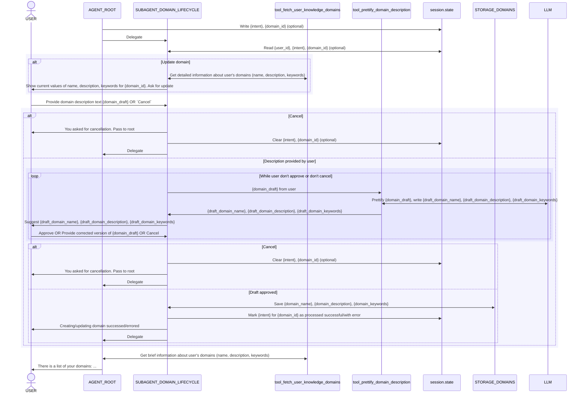
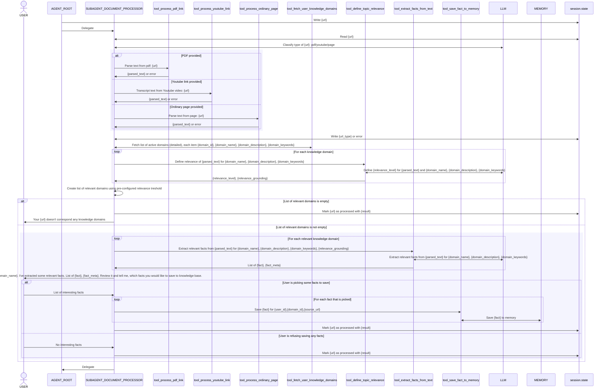

# Requirements

## Документация
- https://google.github.io/adk-docs/sessions/

## Бизнес-требования
Основное предназначение сессии:
- хранить данные о пользователе на протяжении всего диалога (user_id)
- хранить количество неуспешных попыток аутентификации пользователя (name_attempts)
- служить средой передачи информации при взаимодействиях agent_root и субагентов subagent_domain_lifecycle, subagent_document_processor

Сессия живёт в течение одного диалога пользователя с агентом и его субагентами; если пользователь прерывает диалог, выйдя из чата, сессия завершается; при следующем заходе этого же пользователя будет создана новая сессия.

## Данные, хранимые в session.state
- id пользователя
- имя пользователя
- количество неуспешных попыток аутентификации пользователя

### Взаимодействие `agent_root` <<->> `subagent_domain_lifecycle`

Цель - удалить временные поля (intent/domain_id/url/pending_draft) из payload, держать их в сессии при взаимодействии агентов.

Предусловия:
- agent_root получил от пользователя намерение создать новый домен, либо изменить существующий, указан {domain_id}
- agent_root провалидировал {domain_id}, подтвердил его существование и принадлежность текущему пользователю

Взаимодействие компонентов:

### Взаимодействие `agent_root` <<->> `subagent_document_processor`

Цель - отказаться от временных полей payload при взаимодействии агентов.

Предусловия:
- agent_root получил от пользователя текст, содержащий как минимум один корректный url
- agent_root извлёк из текста первый url

Взаимодействие компонентов:

---

Дополнительные комментарии:
- не требуется хранить pending draft (domain_draft) в состоянии сессии, чтобы восстановить после сбоя/повторного запроса
- при отменах поля в session.state должны сбрасываться явным образом

Использованные наименования переменных не являются строгими; кодинг-агент вправе изменять их при целесообразности без дополнительного согласования.
Список данных, хранимых в сессии, может быть расширен. Кодинг-агент ДОЛЖЕН явно согласовать со мной ЛЮБЫЕ дополнительные поля.

## Системные требования
- Использовать ADK/InMemorySessionService https://context7.com/google/adk-python/llms.txt?topic=InMemorySessionService&tokens=10000 и для Dev, и для Prod
- Работа с сессиями реализуется для обеих входных точек: cli, web
- session_id генерируется на сервере при первом сообщении и передаётся клиенту
- необходимо, чтобы session_id использовался как префикс в значениях trace_id (или атрибут другого вида, позволяющий собрать все трейсы конкретной сессии)

### Ограничения реализации:
- Не требуется связывать session_id и user_id
- Не требуется персистентное хранение сессий и их восстановление после перезапуска сервера
- Не требуется контроль времени жизни, либо длины сессии
- Не требуется контроль количества одновременных сессий пользователя (т.е. пользователь может одновременно иметь несколько сессий)
- Не требуется создавать события логов при чтении/записи сессии
- Не требуется фичефлаг для совместимости со старой реализацией

## Требования к тестированию:
- Проверять успешную запись/чтение сессии при hand-off'е между агентами
- При тестировании допустимо использовать мок-инструменты, либо реальные Firestore/Gemini (На усмотрение кодинг-агента)
- НЕ ТРЕБУЕТСЯ проверять поддержку нескольких одновременных сессий для одного пользователя

---

# Implementation plan
1) Подготовка и зависимости
- Проверить версию adk-python с поддержкой InMemorySessionService; при необходимости обновить зависимость/lock.
- Добавить модуль/инициализацию Runner/SessionService, общий для CLI и web.

2) Инициализация SessionService и генерация session_id
- Создать фабрику get_session_service() (InMemorySessionService).
- Реализовать серверную генерацию session_id при первом сообщении; возвращать клиенту.
- Включить session_id в ответ API и CLI, сохранять для следующих ходов.

3) Подключение Runner с Session API
- Обернуть вызовы агентов через Runner, передавая session_id и сообщение.
- CLI: ./adk chat создаёт/переиспользует session_id, передаёт в Runner, хранит локально.
- Web: /chat/message принимает optional session_id, при отсутствии — создаёт, всегда возвращает.

4) Модель session.state
- Хранить user_id, user_name, name_attempts (минимум по ТЗ).
- Добавить хелперы чтения/записи state внутри агентов; дополнительные поля — только после согласования.

5) Обновление agent_root
- Чтение/запись user_id/user_name/name_attempts из session.state.
- После успешной аутентификации писать user_id/user_name; обновлять name_attempts.
- Перед делегацией писать intent/domain_id/url в state вместо временных полей payload.

6) Обновление subagent_domain_lifecycle
- Читать intent/domain_id/user_id из session.state, не из payload.
- После завершения (успех/ошибка/отмена) очищать intent/domain_id в state.
- Не хранить domain_draft в state (по ТЗ); использовать ответы для драфта.

7) Обновление subagent_document_processor
- Читать url (и контекст) из session.state, не из payload.
- Писать url_type/статус обработки при необходимости; очищать url при завершении/отказе.

8) Трассировка и session_id
- Добавить session_id как префикс/атрибут к trace_id или как label; прокинуть в spans/logs.
- Общий trace для root/субагентов/тулов с session_id атрибутом.

9) Адаптация API слоёв (CLI/web)
- CLI: хранить/показывать session_id, передавать в Runner; убрать ручное хранение session_user_id/name_attempts.
- Web: контракт /chat/message расширить session_id in/out, пробрасывать в Runner.

10) Тестирование
- unit: чтение/запись state (user_id/name/name_attempts) при auth/name flow.
- e2e/integration: handoff root→domain_lifecycle (intent/domain_id из state, очистка при cancel/confirm); root→document_processor (url в state, очистка).
- Проверить сохранение state в рамках одного session_id (InMemorySessionService); многосессии не тестировать.
- Инструменты могут быть мок или реальные Firestore/Gemini по выбору.

11) Документация
- Обновить README: протокол session_id (генерация сервером, возврат клиенту), ограничения (InMemory, нет восстановления после рестарта), связь session_id↔trace.
- Зафиксировать новые настройки, если появятся.

12) Чистка и совместимость
- Удалить временные поля из payload, где они дублируют state; оставить минимально необходимое для ответов.
- Фичефлаг отката не требуется (по ТЗ).
